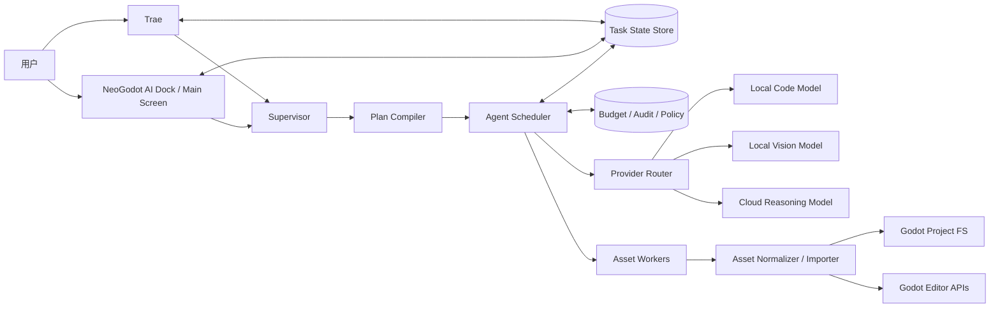
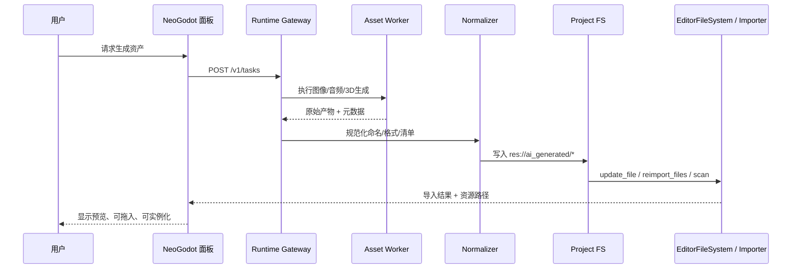
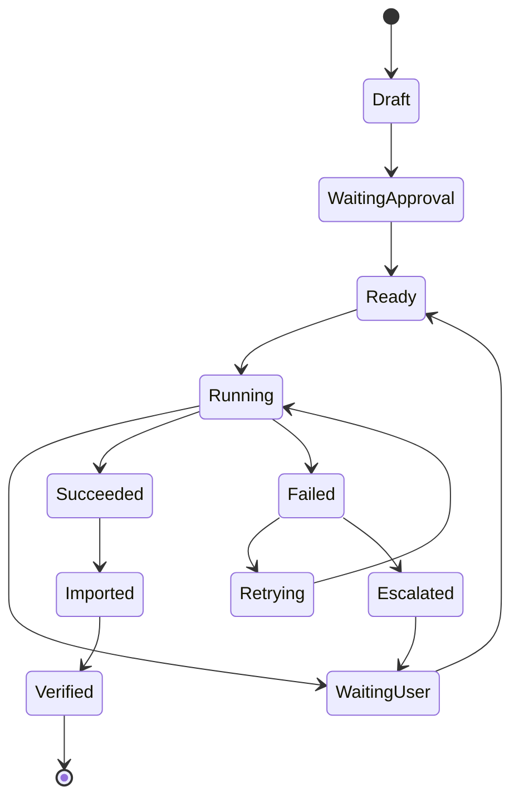
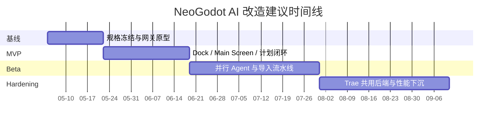

# NeoGodot 内嵌 AI 引擎与端到端游戏开发改造研究报告

## 执行摘要

由 entity["organization","Oasis-Company","github repo owner"] 在 entity["company","GitHub","developer platform"] 上公开的 NeoGodot 目前从公开可见信息看，仍然主要表现为 Godot 上游源码的一个 fork：仓库首页明确显示其 fork 自 `godotengine/godot`，顶层目录仍是标准的 `core / editor / modules / scene / servers / platform / tests` 结构，而公开 README 也仍基本沿用上游 Godot 的说明文本。这意味着，至少在公开仓库层面，用户要求的“内嵌 AI 引擎、操作面板、并行 Agent、Supervisor”尚未形成可复用的现成子系统；因此，本报告把这些能力视为**面向现有 fork 的增量式绿色改造**，而不是对一个已有 AI 子系统做小修小补。citeturn1view0turn3view0

从架构上看，最稳妥的路线不是“一开始就大面积改 Godot 核心”，而是采取**plugin-first、sidecar-runtime、core-last**：先利用 Godot 官方已经提供的编辑器扩展点——`EditorPlugin`、dock/main screen、`EditorImportPlugin`、Inspector 插件、`EditorUndoRedoManager`、`EditorFileSystem`、`GLTFDocument`/`GLTFDocumentExtension` 等——把 AI 面板、资产导入链路、审批与回滚、资产清单可视化这些能力尽量放在编辑器层；只有在热路径、性能瓶颈或跨编辑器生命周期能力不足时，再把少数能力下沉到 `modules/` 或 `GDExtension`。Godot 官方文档明确指出，插件可以完全用 GDScript 与场景构建而无需重编译，而 GDExtension 则允许在不重新编译引擎的前提下装入原生动态库；这恰好适合你要做的“先快后深”的迭代方式。citeturn26search2turn24view0turn24view1turn4search3turn30search3

AI 引擎本身不应设计成“单模型独裁”，而应设计成**统一网关下的多模型分工**。对 NeoGodot 这种“既要架构规划、又要代码生成、还要看图看界面、并最终产出 Godot 可导入资产”的场景，建议把模型分为三层：一是**Supervisor/架构模型**，优先质量与长上下文；二是**代码与子任务执行模型**，优先成本与 agent 友好性；三是**视觉/多模态模型**，负责截图、UI 草图、素材草案理解。结合当前官方资料，MVP 最合理的默认组合是：云端用 Claude Sonnet 4.6 或 GPT-5.4 mini 负责高质量推理与大部分编排，本地用 qwen3-coder:30b 作为离线 fallback，可选再接一个 qwen3-vl:30b 处理截图与视觉草案；若未来要做私有云高吞吐，再引入 vLLM + Llama 3.3 70B 或同级开源权重。citeturn33search1turn33search0turn32search0turn36search2turn36search5turn10search0turn20search0

从交付角度看，本项目更像“编辑器平台产品”而不是单一插件。若以公开仓库为基线，推荐按四阶段推进：先做编辑器内 AI 面板与计划/审批闭环，再做并行 Agent 调度与资产导入流水线，再做 Trae 共用后端与模型网关，最后再把少数高频能力下沉到模块或 GDExtension。以 4–6 人小队估算，做出可演示的 MVP 大致需要 6–8 周，做出具备并行 Agent、审批、导入、测试闭环的 Beta 通常需要 16–24 周。时间的关键约束不在“写几段 prompt”，而在于 Godot 源码级构建、插件与模块边界、资产导入正确性、回滚与测试体系，以及后续与上游 Godot 的 merge 成本。citeturn30search0turn30search21turn24view2turn25search0

## 目标与范围

本项目的核心目标，不是把一个聊天框塞进编辑器，而是把 NeoGodot 变成一个**可计划、可执行、可追踪、可审批、可回滚**的 AI 游戏开发工作台。该目标可分解为五个结果：其一，在编辑器内部提供一个持续可见的 AI 操作面板；其二，让 AI 能把任务拆成并行 Agent 子任务；其三，生成的代码、场景与资产进入 Godot 官方支持的编辑器资源体系；其四，在关键不确定点上由 Supervisor 主动向用户提问并解释后果；其五，整个后端同时能被 NeoGodot 与 Trae 复用，避免“编辑器里一套、IDE 里又一套”的双系统。Godot 官方文档已经提供了 dock、main screen、导入插件、Inspector、文件系统刷新与 Undo/Redo 等关键扩展点，而 Trae 官方文档又提供了 Builder、自定义 Agents、MCP、Rules、Skills、自定义模型与自定义请求 URL，这使得“一个共享运行时，两个前端入口”的方案具备现实基础。citeturn24view0turn26search0turn24view1turn24view2turn25search0turn28search1turn29search0turn6search5turn6search8turn28search0turn28search2

下表给出本报告采用的功能边界。凡用户未明确给出的，按要求标记为“未指定”。

| 范畴 | 结论 |
|---|---|
| 编辑器内 AI 面板、任务计划、审批、回滚 | **纳入** |
| 并行 Agent 调度、任务状态机、执行日志、失败恢复 | **纳入** |
| 资产生成后的标准化、导入、重导入、导航到资源 | **纳入** |
| NeoGodot 与 Trae 共用后端、共用工具协议/模型网关 | **纳入** |
| 上线即具备“全自动商业级大作生产能力” | **不纳入** |
| 训练自有基础模型 | **不纳入** |
| 商业发行层面的完整法务背书与第三方赔偿 | **不纳入** |
| 运行时游戏内 NPC AI、线上运营系统 | **未指定** |
| 图像生成、音频生成、3D 生成的具体供应商/模型 | **未指定** |
| 目标平台（Windows/macOS/Linux）优先级 | **未指定** |
| 数据驻留、合规区、团队安全边界、密钥保管方式 | **未指定** |
| 团队人数上限、预算上限、首个发布日期 | **未指定** |

有一个非常重要的边界判断：如果目标是“让生成资产可直接拖入 Godot”，那就必须优先服从 Godot 的资源与导入体系，而不是把 AI 产物塞进一个私有黑盒缓存。Godot 官方文档明确说明：资源既可以直接复制到项目目录，也可以拖拽到 FileSystem dock；`EditorImportPlugin` 负责把自定义文件扩展导入成新资源类型，并将导入结果放到 `.godot/imported`；`EditorFileSystem` 可以 `update_file()`、`scan()`、`reimport_files()`；`FileSystemDock` 可以导航到路径。换言之，正确目标不是“AI 文件浏览器”，而是“AI 产物进入 Godot 原生资源系统”。citeturn5search4turn24view1turn24view2turn24view3

## 技术选型与推荐

对于 NeoGodot 这样的产品，技术选型应先回答一个战略问题：**AI 是嵌在引擎进程里，还是在引擎外跑 sidecar runtime？** 基于 Godot 官方扩展模型与公开 NeoGodot 仓库现状，本报告明确建议：**把推理与 Agent 执行放在 NeoGodot 进程外，把编辑器交互、资源导入与审批放在 NeoGodot 进程内。** 原因有三。第一，Godot 插件已经足够覆盖 UI、导入、资源检查、状态持久化与 Undo/Redo，因此没必要一开始就往核心塞网络与模型推理。第二，`GDExtension` 和模块都能扩展能力，但越早把逻辑写入 fork 的核心，后续与上游同步就越痛。第三，`EditorFileSystem.reimport_files()` 是阻塞式的，模型推理、外部命令与多 Agent 并行若都挤在编辑器主线程附近，界面冻结与崩溃恢复将很难做稳。citeturn26search2turn4search3turn30search3turn24view2turn1view0

成本估算方面，下表中的云服务行同时给出**官方公开单价**与一个统一假设下的代表性任务成本：假设一次“中等复杂度子任务”平均消耗 50k 输入 token 与 15k 输出 token，则成本约为 `输入单价×0.05 + 输出单价×0.015`。本地模型因为软件侧多为开放权重与本地运行，**边际软件成本可近似视为 0**，但硬件采购与折旧用户未指定，因此统一标为“硬件未指定”。citeturn32search0turn33search0

| 方案 | 部署方式 | 优点 | 缺点 | 许可/条款形态 | 成本估算 | Godot / Trae 集成复杂度 | 最适合承担的角色 | 依据 |
|---|---|---|---|---|---|---|---|---|
| 来自 entity["company","Ollama","ai tooling company"] 的 `qwen3-coder:30b` | 本地 | 面向 agentic coding，30B 总参数但仅 3.3B 激活；原生 256K 上下文，可扩展到 1M；适合代码生成、Repo 级理解、子任务执行 | 视觉理解弱于 VL 模型；本地部署与模型管理工作要自己承担 | 开放权重，Apache 2.0 | 软件侧近似 $0；硬件未指定 | Godot：低；Trae：中（建议经统一模型网关接入） | 代码子任务、补丁生成、批量重构 | citeturn36search2turn31search1turn28search0turn28search2 |
| `qwen3-vl:30b` | 本地 | 支持文本+图像输入，具备视觉 Agent 能力；官方 tags 页面可见 256K 上下文与约 20GB 体量，适合截图分析、UI 草图理解、场景参考图分析 | 代码质量通常不如 code-specialized 模型；本地显存/内存门槛更高 | 开放权重，Apache 2.0 | 软件侧近似 $0；本地模型体量约 20GB；硬件未指定 | Godot：低；Trae：中 | 截图理解、UI/关卡视觉评审、资产草图分析 | citeturn36search5turn36search7turn31search4turn31search1 |
| `vLLM + Llama 3.3 70B` | 私有云 / 本地服务器 | vLLM 提供 OpenAI 兼容 HTTP Server，可直接复用现成客户端与网关；Llama 3.3 是 70B 指令模型，适合作为高吞吐私有部署主模型 | 70B 自托管门槛高，通常需要更重的 GPU 规划；Llama 社区许可证需法务复核 | Llama 3.3 Community License | 软件侧近似 $0；硬件未指定 | Godot：中；Trae：低到中（因可经 OpenAI-compatible 网关） | 私有部署主推理、批量任务、团队内共享服务 | citeturn10search0turn20search0turn21search1turn21search5 |
| 来自 entity["company","OpenAI","ai company"] 的 GPT-5.4 mini + Responses API | 云服务 | 官方直接定位为“最强 mini coding / computer use / subagents”；Responses API 自带 built-in tools 与 Agents SDK/Tracing 思路，适合作为低成本执行层 | 云成本持续发生；对外网与供应商 SLA 有依赖 | 商业 API | $0.75 / 1M 输入、$4.50 / 1M 输出；按统一假设约 $0.105 / 子任务 | Godot：低；Trae：低到中 | 执行型 Subagent、批量代码处理、成本敏感场景 | citeturn32search0turn13search2 |
| 来自 entity["company","Anthropic","ai company"] 的 Claude Sonnet 4.6 | 云服务 | 官方模型概览显示其具有 1M 上下文、低延迟、强工具调用与 agentic 适配性；适合架构规划、Supervisor、长上下文设计讨论 | 成本高于 GPT-5.4 mini；仍属闭源商业 API | 商业 API | $3 / 1M 输入、$15 / 1M 输出；按统一假设约 $0.375 / 子任务 | Godot：低；Trae：低到中 | Supervisor、架构规划、长上下文设计与审查 | citeturn33search1turn33search0turn33search9 |

如果你把“长上下文 + 函数/工具组合 + Google 搜索接地”看得比稳定商用更重要，来自 entity["company","Google","technology company"] 的 Gemini 3.1 Pro Preview 也是一条可行路线。其官方文档给出 1M/64k 窗口与 `$2 / $12`（<200k token）定价，同时提供函数调用、工具组合与内建工具组合机制。但由于官方名称里仍带 Preview，本报告不建议在第一阶段把它作为**唯一**主模型，而更适合作为“对照组”或后备提供方。citeturn15search16turn15search1turn15search4turn15search6

综合比较之后，我的建议非常明确：

第一阶段的默认栈应是**云质量优先 + 本地兜底**：Supervisor 使用 Claude Sonnet 4.6，执行型子任务使用 GPT-5.4 mini，本地保底接 `qwen3-coder:30b`，截图/界面理解可选再挂 `qwen3-vl:30b`。原因是：Supervisor 需要更强的长上下文与“提问质量”，执行型子任务更看重成本与吞吐，而本地模型则承担离线、隐私与故障降级。citeturn33search1turn33search0turn32search0turn36search2turn36search5

第二阶段如果团队要走私有化或高吞吐，就把统一网关后端切到 `vLLM + Llama 3.3 70B` 或同级开源模型；因为 vLLM 官方就直接提供 OpenAI-compatible server，这意味着 NeoGodot 的 provider adapter 和 Trae 的自定义模型请求 URL 都可以不变，只换后端部署。这样改造半径最小。citeturn10search0turn28search0turn28search2

## 系统架构设计

推荐的系统形态不是“Godot 插件直连多个模型 API”，而是**Neo Runtime Gateway** 作为统一后端，NeoGodot 与 Trae 都只对接这一层。这样做有四个直接收益：其一，供应商切换在网关层完成，编辑器与 IDE 不被绑死；其二，所有 Agent 共享同一套预算、审计、缓存、状态机与 artifact registry；其三，Trae 可以通过自定义模型、自定义请求 URL、MCP server 重用同一后端；其四，Godot 端只需使用其已有的 HTTP/TCP/编辑器接口即可，不必把复杂推理逻辑塞进主进程。Godot 官方文档已经说明 `HTTPRequest` 可直接发 REST 请求，`TCPServer`/`StreamPeerTCP` 可自建长连接或事件通道；vLLM 提供 OpenAI-compatible HTTP server；Trae 官方文档则说明其支持自定义模型、自定义请求 URL 与 MCP servers。citeturn5search2turn5search5turn23search2turn10search0turn28search0turn28search2turn29search0



这个架构有两个前端入口，但只有一个事实来源。NeoGodot 里的 panel 负责计划可视化、审批、导入、资源定位和场景落地；Trae 负责源码级编辑、命令执行、文档编写和源代码大范围重构；Supervisor、Scheduler、Artifact Registry、Budget/Audit 全部在中间层统一。这样一来，你在 Trae 里让 Agent 改代码，在 NeoGodot 里让 Agent 生成场景与资源，最终看到的是同一个 DAG、同一套 artifact IDs、同一份审计日志，而不是两个互不相通的“AI 助手”。citeturn9search0turn28search1turn26search7

### 组件职责

| 组件 | 职责 | 备注 |
|---|---|---|
| NeoGodot AI Dock | 常驻状态、问题卡片、预算条、最近产物 | 用 `add_dock()` 接入 |
| NeoGodot Main Screen | 全屏任务编排、计划树、批量资产视图 | 用 main screen plugin 接入 |
| Supervisor | 判断何时询问、何时继续、何时审批 | 不是执行器，是“节奏控制器” |
| Plan Compiler | 把自然语言目标编译成可执行 DAG | 必须输出结构化 JSON，不直接跑命令 |
| Agent Scheduler | 任务排队、并行控制、资源租约、重试 | 决策应尽量确定性 |
| Provider Router | 模型路由、降级、缓存、配额 | 屏蔽供应商差异 |
| Asset Workers | 图像/音频/3D/脚本/场景等专用执行器 | 允许不同沙箱级别 |
| Importer | 规范文件名、元数据、写盘、触发 reimport | 对接 Godot 原生导入 |
| Task State Store | 任务状态、用户答复、审计、artifact 索引 | 建议事件溯源化 |
| Budget / Audit | 成本阈值、动作日志、外网访问记录 | 给 Supervisor 提示依据 |

### API 规范

内部 API 建议保持**小而刚性**。NeoGodot 面板、Trae、以及 Worker 之间统一使用 JSON Schema 定义消息，外层协议优先选 REST + WebSocket；如果需要与 Trae 的工具生态强耦合，则在网关层增加 MCP bridge，而不是让核心调度器直接说 MCP。这样可以把“编辑器协议”和“工具协议”分层，便于未来替换。Trae 支持 MCP servers，而 OpenAI-compatible server 与普通 REST/WS 网关又有更广的生态兼容性。citeturn29search0turn10search0turn5search2turn23search2

建议最小 API 面如下：

| 方法 | 路径 | 作用 | 请求重点 | 返回重点 |
|---|---|---|---|---|
| POST | `/v1/sessions` | 创建会话 | 项目路径、模式、预算、选定模型 | `session_id` |
| POST | `/v1/plan` | 生成或重生成计划 | 目标、上下文、约束、已有产物 | DAG、风险点、待询问项 |
| POST | `/v1/tasks` | 提交任务 | `kind`、依赖、成本上限、输出路径 | `task_id` |
| GET | `/v1/tasks/{id}` | 查询状态 | — | 状态、日志、artifact IDs |
| WS | `/v1/events` | 实时事件流 | `session_id` | `task.started / task.failed / question.raised / artifact.ready` |
| POST | `/v1/questions/{id}/answer` | 用户答复 | 选项或自由文本 | 继续执行或重规划 |
| POST | `/v1/import` | 导入一批产物 | 文件路径、资源类型、目标目录 | 资源路径、导入结果 |
| POST | `/v1/rollback` | 回滚一个变更批次 | `change_set_id` | 回滚结果 |

典型任务提交体示意如下：

```json
{
  "kind": "asset.image.ui",
  "session_id": "sess_001",
  "depends_on": ["task_style_01"],
  "budget": {
    "max_cost_usd": 1.5,
    "max_latency_ms": 60000
  },
  "output": {
    "path": "res://ai_generated/ui/button_primary.png",
    "format": "png"
  },
  "metadata": {
    "purpose": "primary_button",
    "style_ref": "neo_style_v2"
  }
}
```

### 资产生成与导入流水线

Godot 的官方资产管线决定了我们应该倒推 AI 产出格式：2D 图像优先输出 Godot 支持的标准图片格式；音频优先输出 WAV 或 Ogg Vorbis；3D 场景优先输出 `.glb/.gltf`；脚本与场景尽量落为 `.gd/.cs/.tscn/.tres` 等 Godot 原生或原生可消费格式。Godot 官方文档明确建议 glTF 2.0 作为 3D 推荐格式；音频则说明短音效更适合 WAV、音乐/语音/长音频更适合 Ogg Vorbis；`GLTFDocument` 支持读写 glTF 并允许注册 `GLTFDocumentExtension`；`EditorImportPlugin` 则允许把自定义扩展导入成一等资源。citeturn22search0turn22search1turn22search4turn22search11turn22search15turn24view4turn24view1

因此，建议把 AI 资产流水线设计成“三段式”：

第一段是**生成与规范化**。任何模型或工具先把结果写到 staging 目录，然后由 normalizer 统一做命名、尺寸、采样率、颜色空间、元数据补全与指纹哈希。  
第二段是**写入项目并触发 Godot 原生导入**。对原生支持格式，直接写进 `res://ai_generated/...`；对需要自定义处理的，则写一个 sidecar manifest（例如 `.neoasset.json`），由 `EditorImportPlugin` 导入成资源。  
第三段是**导入后落地**。导入成功后，面板自动导航到资源；若资源类型允许直接实例化，则给出“一键实例化到当前场景”“一键设为纹理/音频/材质”的操作。citeturn5search4turn24view1turn24view2turn24view3turn5search11



下面这段 GDScript 更接近可落地的伪代码：它展示了“外部程序或 sidecar 写入文件后，如何让 Godot 识别并重导入，再把文件系统定位到结果资源”。Godot 官方文档明确给出了 `EditorFileSystem.update_file()`、`reimport_files()` 以及 `FileSystemDock.navigate_to_path()` 的能力。citeturn24view2turn24view3turn39search11

```gdscript
@tool
extends EditorPlugin

func reimport_generated_assets(files: PackedStringArray) -> void:
    var ei = get_editor_interface()
    var fs = ei.get_resource_filesystem()

    for path in files:
        fs.update_file(path)

    fs.reimport_files(files)

    if files.size() > 0:
        ei.get_file_system_dock().navigate_to_path(files[0])
```

如果后续要把 AI 元数据深度嵌入 3D 产物，建议优先考虑两种做法：一是 glTF 自定义扩展，配合 `GLTFDocumentExtension` 读写；二是 sidecar manifest，再由导入插件合并。前者更利于跨工具链携带元数据，后者更容易在第一阶段快速落地。若 manifest 资源会被场景依赖，导入顺序应遵循 Godot 文档中关于自定义 import order 的建议，尽量先于场景导入完成。citeturn24view4turn4search13

## Agent 框架设计

Agent 框架不应让 LLM“直接拥有系统”，而应让 LLM只负责**提案**，让调度器负责**执行权**。官方资料在不同生态里都在强调这个方向：OpenAI 的 Responses API 与 Agents SDK 在解决 built-in tools、orchestration、tracing；Anthropic 文档明确讨论 tool use 与 agentic loop；Gemini 文档则把函数调用、工具组合与工具上下文传递写得很清楚；Trae 的 custom agents 和 MCP 也说明当前主流方向不是“单轮问答”，而是“工具化、可组合、可观察”的 agent 系统。NeoGodot 若要稳定，必须顺着这个产业方向建——**LLM 生成结构化计划，调度器验证、排序、执行、回滚**。citeturn13search2turn33search9turn15search1turn15search4turn15search6turn28search1turn29search0

推荐状态机如下：



并行模型建议采用**DAG + 资源租约**。具体做法是把每个任务标明 `kind`、`depends_on`、`resource_class`、`budget_class`、`risk_level`。例如：  
`code.refactor` 占用 `cpu + llm`；  
`asset.image.ui` 占用 `gpu + llm`；  
`asset.audio.sfx` 占用 `cpu/gpu + llm`；  
`scene.instantiate` 占用 `editor_main_thread`；  
`import.reimport` 占用 `editor_fs_lock`。  

调度器只允许互不冲突的任务并行；凡涉及 `editor_main_thread` 或 `editor_fs_lock` 的任务必须串行，因为 Godot 的资源扫描与重导入是用户可感知且会阻塞流程的。这样做的要点不是“并发越多越好”，而是“让最贵资源始终被正确占用，且不会在导入阶段把编辑器拖死”。citeturn24view2turn23search0

资源隔离方面，建议分三层：

一层是**纯推理型子任务**，只能读上下文、写结构化结果，不允许触碰项目文件。  
二层是**受限写入型子任务**，只能写 staging 目录，不允许直接改 `res://` 正式产物。  
三层是**提升权限型子任务**，例如批量改代码、写场景、覆盖资源，这类必须经过 Scheduler 的 change-set 包装，并在需要时走 Supervisor 审批。  

Godot 自己已经提供了与编辑器 Undo/Redo 历史对接的 `EditorUndoRedoManager`，因此所有“落到项目中的编辑器动作”都应尽量封装成一个 change-set 并注册 undo/redo。这样即使 Agent 输出错误，也不至于只能靠 Git 整体回滚。citeturn25search0turn25search4

通信协议上，建议内部统一使用下面这样的信封格式，而不是让每家模型返回完全自由文本：

```json
{
  "type": "task.result",
  "task_id": "task_123",
  "status": "succeeded",
  "outputs": [
    {"kind": "file", "path": "res://ai_generated/ui/button_primary.png"},
    {"kind": "metadata", "artifact_id": "art_987"}
  ],
  "cost": {"input_tokens": 3200, "output_tokens": 840, "usd_estimate": 0.009},
  "explain": {
    "summary": "生成了主按钮纹理并输出了可导入 PNG",
    "assumptions": ["使用赛博蓝风格", "尺寸 256x96"]
  }
}
```

失败恢复要建立在**幂等输出与检查点**之上。最实用的策略不是复杂的“自治修复”，而是四件事：输出文件先写到临时路径；同输入产生相同 artifact hash；失败时保留中间结果与 stderr；重试前先判断是否已存在可复用产物。对外部网络模型则再加三件事：指数退避、供应商降级、预算熔断。这样才能把“AI 有时不稳定”转化成“系统仍然可恢复”。这一层做不好，Supervisor 就会被迫不断人工救火。citeturn32search0turn33search0turn10search0

下面是一段更接近生产思路的调度伪代码：

```python
def dispatch_ready_tasks(graph, budget, workers):
    ready = [t for t in graph.tasks if t.is_ready()]

    # 先确定性过滤，再让模型参与提案，不让模型直接下发系统命令
    ready = sort_by_priority_then_cost(ready)

    for task in ready:
        if task.risk_level == "high" and not task.user_approved:
            block_for_supervisor(task)
            continue

        if budget.would_exceed(task.estimated_cost_usd):
            raise_question(
                task,
                reason="budget_exceeded",
                choices=["切换低成本模型", "缩小范围", "继续并追加预算"]
            )
            continue

        worker = workers.lease(task.resource_class)
        if not worker:
            continue

        task.state = "running"
        worker.run(task)
```

## Supervisor 交互设计

真正好用的 Supervisor 不是“随时打断用户”，而是“只在最该问的时候问，而且告诉用户：如果你不回答，我将如何默认继续”。这类设计本质上是产品设计，不是模型选择问题。NeoGodot 内的 Supervisor 应该更像一个**带预算感、变更感、风险感的项目经理**，而不是一个永远要求澄清的客服机器人。Godot 的插件状态持久化、窗口布局保存、Undo/Redo 与未保存状态钩子，为这种“阶段性审批”提供了技术土壤；Trae 的 Builder/Agent/Rules/Skills 则提供了在 IDE 端复用同样决策逻辑的可能。citeturn26search5turn25search4turn25search0turn9search0turn6search5turn6search8

建议把询问触发分成五类：

| 触发类型 | 何时触发 | 默认动作 |
|---|---|---|
| 信息缺口 | 缺风格、目标平台、输入输出格式、资源命名规则 | 先给默认假设，再请用户确认 |
| 架构岔路 | 出现两个以上成本/维护性差异显著的方案 | 展示对比并要求选路 |
| 破坏性变更 | 覆盖已有资源、批量删改、跨目录移动、Scene 重写 | 必审 |
| 成本跳变 | 预计超出 token、搜索、容器或外部工具预算阈值 | 提供降级选项 |
| 验证失败 | 测试失败、导入失败、资源类型不符、依赖缺失 | 请求补充信息或回滚 |

提示策略应始终遵循**先结论、后理由、再选项、最后默认值**。例如，不要问“要不要确认一下 UI 风格？”；而要问：“当前缺少 UI 风格定义。若不回答，我会按现有项目主色与默认按钮尺寸继续生成；这会影响 12 个新资源的视觉一致性。你可以选择：A 沿用当前主题；B 上传参考图；C 只生成占位资产。” 这类提示不仅更少打扰，也更容易让用户持续前进。

建议在操作面板里把 Supervisor 设计成一个固定区域，而不是弹窗轰炸。可采用下面这个原型：

```text
┌──────────────── Neo AI ────────────────┐
│ 目标：做一个 2D Boss 战原型             │
│ 模式：守卫式 / 本地优先 / 预算 $20      │
│ 阶段：Plan → Code → Assets → Import    │
│                                         │
│ 当前决定                                   │
│ - 主模型：Claude Sonnet 4.6             │
│ - 代码子任务：GPT-5.4 mini             │
│ - 视觉分析：qwen3-vl:30b               │
│                                         │
│ 待回答问题（1）                           │
│ 缺少 UI 风格参考。若不回答，将沿用主题色。 │
│ 影响：12 个 UI 资产 / 预计额外成本 $0.6   │
│ [沿用当前主题] [上传参考图] [只做占位图]   │
│                                         │
│ 最近产物                                   │
│ - res://ai_generated/ui/button_primary.png│
│ - res://ai_generated/sfx/boss_hit.ogg     │
│ [定位资源] [实例化到当前场景] [回滚最近一批]│
└───────────────────────────────────────┘
```

配置性方面，建议至少暴露六个可调项：自主级别、预算阈值、破坏性变更阈值、是否允许外网、是否允许直接写 `res://`、是否允许自动实例化到场景。解释性方面，建议每个问题与每个大动作都带上四个字段：**为什么这样做、如果不答会怎么做、会影响哪些文件/资源、如何回滚**。这是少数真正能显著提升用户信任的地方。

如果你进一步追求高级 UX，我建议把 Supervisor 做成三种模式：

- **影子模式**：只建议，不自动执行。适合第一次接触项目的新成员。  
- **守卫模式**：低风险自动，高风险必审。适合大多数团队。  
- **协作模式**：每个阶段切换都先问。适合架构设计与风格冻结阶段。  

这三种模式与预算阈值、规则集、目标目录黑白名单一起构成“可配置自治度”。

## Trae 与 NeoGodot 集成实施

Trae 在本项目里的最佳角色不是“替代 NeoGodot 面板”，而是成为**源代码级主工作台**。公开文档显示，Trae 的 Builder 模式会主动读取当前项目文件、拆分任务、创建或修改文件、生成并运行命令；Trae 还支持自定义 agents、MCP servers、Rules、Skills、代码索引、自定义模型、自定义请求 URL，并提供 Resource Explorer 与 Max mode。这一组能力非常适合开发引擎 fork、管理大仓库上下文、复用统一工具后端，以及把“代码层工作流”与“编辑器层工作流”拆开治理。Trae 的官方 Quickstart 还说明可通过 `trae` shell command 直接打开项目目录。citeturn9search0turn28search1turn29search0turn6search5turn6search8turn9search4turn28search0turn28search2turn6search12turn6search14turn9search1

### 建议的代码改动点

结合 NeoGodot 当前公开目录结构与 Godot 官方对插件、模块、GDExtension 的建议，本项目应优先改以下位置：

| 位置 | 改动内容 | 首选实现方式 | 迁移风险 |
|---|---|---|---|
| `editor/` | 内置 AI UI、命令、面板、主界面集成、资源落地入口 | EditorPlugin / main screen / Inspector | 中 |
| `modules/neo_ai/` | 仅放必须下沉的核心能力，如高频编辑器桥接、统一服务注册 | 自定义模块 | 高 |
| `doc/` | 用户手册、架构说明、模型接入说明、运维文档 | 文档即代码 | 低 |
| `tests/` | 调度器、导入器、示例工程、回归测试 | fixture 项目 + golden tests | 低 |
| `thirdparty/` | 仅当必须内嵌依赖时使用 | 尽量避免第一阶段进入 | 很高 |

公开仓库首页能确认 `editor/`、`modules/`、`tests/`、`doc/` 等标准目录都已存在；Godot 文档则明确说明插件适合快速扩展，模块适合更深层引擎能力扩展。因此，**第一阶段尽量不碰 `core/scene/servers/platform`**，除非已经通过 profiling 证明插件/GDExtension 无法满足。citeturn1view0turn30search3turn4search3turn26search2

### 实施步骤

建议按下面的顺序实施，而不是一口气把所有东西都塞进 fork：

先在 Trae 中建立仓库级规则。由于 Trae 支持 Rules、Skills、自定义 agents 与 MCP servers，应先把“插件优先、模块谨慎、所有变更必须可回滚、AI 产物必须进入原生资源系统、禁止未审批覆盖资源”等规则固化为 `.trae/rules/` 和团队级 agent prompts。这样可以把“口头共识”变成 IDE 可执行约束。citeturn6search5turn6search8turn29search1

然后建立统一后端网关。因为 Trae 支持自定义模型与自定义请求 URL，而 vLLM 也提供 OpenAI-compatible server，所以应先把模型提供层网关抽象出来，再让 NeoGodot 和 Trae 一起指向它。这样可以避免以后在 Godot 插件代码和 Trae 配置里重复维护模型逻辑。citeturn28search0turn28search2turn10search0

接着做 Godot 端的 MVP 插件：一个 dock + 一个 main screen。dock 常驻显示状态、预算、问题；main screen 用于计划树、批量产物、任务依赖视图。Godot 官方文档明确支持两类 UI，因此无须一开始就改核心工作区。citeturn24view0turn26search0turn26search5

再做导入链路。优先支持 `png / ogg / wav / glb / gd / tscn / tres`，加一个轻量 manifest importer。做到这一步后，用户已经可以从一个目标描述出发，生成一个可导入、可定位、可实例化的资源闭环。citeturn22search0turn22search1turn22search4turn24view1turn24view2turn24view3

然后再引入并行 Agent 与审批。注意先有可追踪 artifact，再有并行；先有审批与回滚，再有自动覆盖。否则一旦并行写文件和编辑器导入冲突，现场会非常难收拾。

最后才是性能下沉：哪些调用量高、跨语言桥多、插件层太慢，就把它们迁到 `modules/neo_ai/` 或 `GDExtension`。Godot 文档已经把“插件”和“模块”区分得很清楚，这一步不应该先于产品验证。citeturn26search2turn30search3turn4search3

### Trae 的具体集成建议

Trae 端建议至少配置以下 5 个自定义 agents：

| Agent 名称 | 职责 |
|---|---|
| `neo-architect` | 出计划、画模块边界、生成 ADR |
| `neo-editor` | 只改 `editor/` 相关 UI 与交互 |
| `neo-runtime` | 只改网关、调度器、provider adapters |
| `neo-importer` | 只改资产标准化与导入链路 |
| `neo-test-release` | 只做测试、打包、文档与变更审计 |

这些 agents 都应连接到同一个 MCP/工具层：编译命令、测试运行器、格式化、fixture 项目、资源检查器。这样做的好处是，Trae 的 Agent 与 NeoGodot 里的 Agent 框架可以共享同一份“工具目录”，只是在 UI 与审批策略上不同。

关于“把 Trae 直接设成 Godot 外部编辑器”的点，Godot 官方文档明确支持外部编辑器调用；Trae 官方文档明确提供 `trae` 命令用于打开项目。但公开文档里**未明确看到** Trae 的“按文件/行号打开”的命令行契约，因此这一点目前应标为**未指定**。工程上最好先实现“从 NeoGodot 一键打开项目到 Trae”，而不是承诺“点击报错直接精确跳到某行”。citeturn25search12turn9search1

下面给出一个最小 dock 插件的示意代码。它没有包含完整错误处理与鉴权，但表达了 Godot 面板和 sidecar runtime 的基本连接方式。Godot 官方文档说明插件可作为 `@tool` 脚本运行于编辑器中，且 `HTTPRequest` 可直接访问 HTTP API。citeturn5search13turn5search2turn24view0

```gdscript
@tool
extends EditorPlugin

var dock: Control
var http: HTTPRequest

func _enter_tree() -> void:
    dock = preload("res://addons/neo_ai/neo_ai_dock.tscn").instantiate()
    http = HTTPRequest.new()
    add_child(http)
    add_dock(dock)
    dock.connect("request_plan", Callable(self, "_on_request_plan"))

func _exit_tree() -> void:
    remove_dock(dock)
    dock.queue_free()
    http.queue_free()

func _on_request_plan(goal: Dictionary) -> void:
    var body := JSON.stringify(goal)
    http.request_completed.connect(_on_plan_completed, CONNECT_ONE_SHOT)
    http.request(
        "http://127.0.0.1:7777/v1/plan",
        ["Content-Type: application/json"],
        HTTPClient.METHOD_POST,
        body
    )

func _on_plan_completed(result: int, code: int, headers: PackedStringArray, body: PackedByteArray) -> void:
    if code != 200:
        push_warning("Neo runtime request failed: " + str(code))
        return
    var data = JSON.parse_string(body.get_string_from_utf8())
    dock.call("render_plan", data)
```

## 路线图、预算与风险

### 开发路线图与里程碑

推荐把路线图拆成四个阶段，每阶段都有可验收产物，而不是按技术层切碎成若干“永远在施工”的分项。

| 阶段 | 时间估算 | 主要产出 | 建议角色 |
|---|---:|---|---|
| 基线与规格冻结 | 2–3 周 | 架构决议、模型网关原型、Trae 规则与 agents、示例工程 | Tech Lead、Godot 工程师、AI 工程师 |
| MVP | 4–5 周 | Dock/Main Screen、Plan API、单线程执行、基础导入链路、手动审批 | Godot 工程师、AI 工程师、工具/UX |
| Beta | 6–8 周 | 并行 Agent、资产标准化、Artifact Registry、Undo/Redo、失败恢复、测试夹具 | Godot 工程师、Runtime 工程师、QA |
| Hardening | 4–8 周 | Trae 共用后端、预算审计、性能优化、必要的模块/GDExtension下沉、文档 | 全员 |



人员角色方面，如果预算与团队规模都未指定，我建议不要小于 4 个核心角色：**技术负责人 / Godot 编辑器工程师 / AI Runtime 工程师 / QA-工具工程师**。若要把体验做好，再补 1 名产品或设计型工程师负责 Supervisor 交互与操作面板。对这种“既是引擎改造、又是 AI 平台、又是工具产品”的项目，单靠 1–2 名全栈硬扛，通常会在第三阶段出现质量崩盘。

### 资源与预算估算

硬件部分，用户没有指定采购标准、地区、币种和税费，因此严格意义上应标注为“未指定”。不过从公开官方资料可以推导出一个最低现实门槛：本地多模态模型并不适合非常轻量的开发机。例如 Ollama 的 Apple Silicon 预览说明就要求机器具备 **32GB 以上统一内存**；而 `qwen3-vl:30b` 官方 tags 页面也能看到约 **20GB** 的模型体量。这说明“本地可用”并不等于“任何机器都能顺畅常驻”。因此，若要走本地优先路线，至少要预留 1 台较强开发机或私有推理节点；具体采购金额因型号未指定，不在公开信息范围内。citeturn11search10turn36search7

云服务成本可以给出更清晰的区间。按前文统一假设——**1,000 次中等复杂度子任务，每次 50k 输入 + 15k 输出 token**——则纯文本推理成本大致如下：

| 方案 | 官方单价 | 约成本 / 1,000 子任务 |
|---|---|---:|
| GPT-5.4 mini | `$0.75 / 1M` 输入；`$4.50 / 1M` 输出 | 约 **$105** |
| Claude Sonnet 4.6 | `$3 / 1M` 输入；`$15 / 1M` 输出 | 约 **$375** |
| Gemini 3.1 Pro Preview | `$2 / 1M` 输入；`$12 / 1M` 输出（<200k） | 约 **$280** |

以上数字**不含**图像生成、Web 搜索、容器执行、文件检索、额外 grounded/tool charges，也不含存储、日志与网络流量。OpenAI 官方价格页还单独列出了 Web search、Containers 等额外工具费用；Anthropic 价格页也说明 server-side tools 会产生额外 usage-based pricing。换言之，真正的成本控制不在“选最便宜模型”，而在于**把昂贵工具调用做成可见、可预算、可熔断**。citeturn32search0turn33search0turn15search16

许可与条款方面，也需要清楚区分几类东西：引擎侧 NeoGodot/Godot 源码仍是 MIT；Qwen 开放权重目前是 Apache 2.0；Llama 3.3 使用 Llama 3.3 Community License；OpenAI、Anthropic、Gemini 这一类则是商业 API 使用关系，而不是“下载权重自己分发”的许可关系。也就是说，**同一个产品里会同时存在 MIT、Apache 2.0、Llama 社区许可、商业 API 条款四种不同治理模式**。这是法务和产品条款设计必须尽早面对的事情。citeturn1view0turn31search1turn21search1turn32search0turn33search0turn15search16

### 风险评估与缓解措施

| 风险类别 | 风险描述 | 影响 | 缓解措施 |
|---|---|---|---|
| 技术 | 直接深改 Godot fork，后续合并上游成本陡增 | 高 | 插件优先，少量能力再下沉到模块/GDExtension |
| 技术 | 导入与重导入阻塞编辑器，造成 UI 冻结 | 高 | 推理与生成全部 sidecar 化；导入阶段串行化；加可取消任务 |
| 法律/许可 | 混用 MIT、Apache 2.0、Llama 社区许可、商业 API | 高 | 建立 provider registry 与法务清单；所有模型/工具配置显式化 |
| 成本 | 工具调用、长上下文、Web 搜索等费用失控 | 高 | 成本预算、工具级熔断、Prompt 缓存、批处理、低价执行层 |
| 性能 | 本地多模态模型门槛高，团队机器差异大 | 中高 | 本地与云双栈；本地只做 fallback/隐私任务；允许运行时降级 |
| 用户体验 | Supervisor 过度打断或过度自治，都会降低信任 | 高 | 提供三种自治模式；所有高风险动作显式“为什么/影响/回滚” |
| IDE 集成 | Trae 公开文档未明确文件/行号 deeplink 约定 | 中 | 先做项目级联动与共用后端，不把精确跳转当成首阶段承诺 |

其中两项风险尤其要强调。第一，Godot 官方文档已经说明插件、模块与 GDExtension是不同层级的扩展方式，而公开 NeoGodot 仓库又是上游 Godot 的 fork；这意味着任何不必要的核心侵入，都会在未来的 upstream merge 中变成复利型负债。第二，Godot 的 `EditorFileSystem.reimport_files()` 明确是阻塞式导入路径的一部分，因此模型推理与导入过程必须分层，不能让“大模型不稳定”和“资源导入阻塞”叠加成最终用户的卡顿与崩溃。citeturn30search3turn4search3turn1view0turn24view2

### 开放问题与局限

本报告基于公开资料进行推导，因此有三点局限需要明示。第一，NeoGodot 公共仓库当前没有公开出 AI 子系统设计文档或专门模块说明，所以若你们在私有分支中已经做了较深改造，实际迁移计划可能需要下调“插件优先”的权重。第二，Trae 的公开文档能确认自定义模型、自定义请求 URL、MCP、Builder、Rule/Skill 等能力，但尚未在我检索到的公开页面中清晰确认“按文件/行列精准唤起外部编辑”契约，因此这部分只能标记为未指定。第三，图像、音频、3D 生成的具体供应商、目标平台、预算上限、部署区域、密钥治理、合规要求均未指定，所以本报告的“预算”和“实现步骤”只适合作为**默认路线**而不是最终承诺。citeturn1view0turn3view0turn28search0turn28search2turn29search0turn9search1

### 官方文档与示例入口

若你要立刻启动项目，最值得优先阅读的公开官方入口有这些：NeoGodot 仓库首页与 README，用于确认公开基线；Godot 的 editor plugins、main screen plugins、import plugins、GDExtension、EditorFileSystem、GLTFDocument 文档，用于落地编辑器内嵌与导入链路；Trae 的 Builder、agents、MCP、rules、skills、models、resource explorer 文档，用于建立开发工作流；以及 OpenAI Responses API、Anthropic tool use、Gemini function calling/tools、vLLM OpenAI-compatible server 文档，用于统一模型网关与 Agent 协议。citeturn1view0turn3view0turn26search2turn26search0turn24view1turn4search3turn24view2turn24view4turn9search0turn28search1turn29search0turn6search5turn6search8turn28search0turn13search2turn33search9turn15search1turn15search4turn10search0