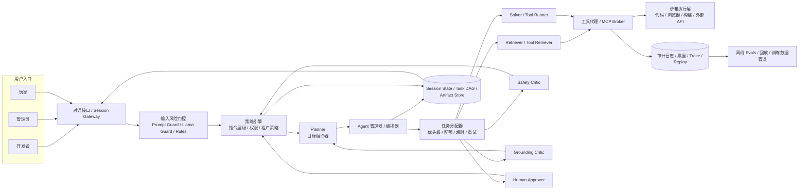
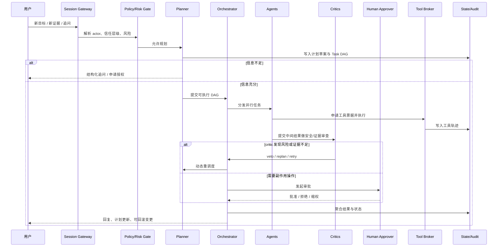

# NeoGodot 对话式 SuperViser 研究与工程规格报告

## 执行摘要

近五年的最佳实践显示，LLM 监督已经从“单模型后处理”转向“对话式控制平面”——用显式策略、分层 guardrails、工具授权、critic、审计回放与持续 eval，围绕多 agent 的计划—执行—观察—重调度闭环来控制风险。对 NeoGodot，建议把 SuperViser 设计成独立微服务/sidecar：既与开发者、管理员、玩家对话，也统一编配 planner、retriever、tool-runner、critic 与 human-approver，并以可审计任务 DAG、权限票据、回滚与红队自动化作为上线底座。citeturn14view0turn14view3turn16view1turn21view5turn14view11turn14view12

## 研究范围与核心判断

本报告聚焦 2021–2026/04 的学术论文、官方技术博客、官方 GitHub/模型卡与治理材料，优先使用 OpenAI、Anthropic、Google DeepMind/Google Research、Meta、NVIDIA、MCP、NIST、OWASP 的原始资料；中文官方材料在可用时优先引用。整体结论非常一致：真正可靠的监督系统不是“再加一个拒答模型”，而是一个把**对话、策略、权限、编排、审计、评估**连成一体的控制平面。OpenAI Agents SDK 已把 sessions、human-in-the-loop、guardrails 与 tracing 做成一等能力；Anthropic把 agent 明确定义为会“计划、行动、观察、调整”的自循环系统；NeMo Guardrails把“可控对话路径”与 LLM 安全控制层直接做成产品；MCP 则把工具、授权与用户同意边界写进协议本身。citeturn14view0turn14view3turn16view1turn20search0turn21view4turn21view5

对 NeoGodot 而言，SuperViser 不应只是“安全过滤器”，而应是**面向多 agent 的对话式编排器**：它接收用户目标，决定是否提问澄清，编译任务 DAG，给 agent 分配角色与预算，授予最小权限工具票据，在新证据到达或 critic 发现问题时动态重调度，并把所有关键决策沉淀为可回放、可评估、可回滚的轨迹。这个定位与 Anthropic 对“既要会对话、又要会行动、且要有明确成功标准与人工监督”的 agent 场景判断高度一致，也与 OpenAI 和 MCP 对 tool-use 风险边界的工程处理方式一致。citeturn18view2turn14view5turn14view6turn21view5

下表给出本报告的核心判断。

| 核心判断 | 工程含义 | 主要证据 |
|---|---|---|
| 监督应是系统级控制平面，而不是模型尾部规则 | 需要单独的策略引擎、工具代理、审计与回放层 | citeturn14view0turn16view1turn14view3 |
| 权限必须从模型中剥离 | 模型只能“提议”动作，执行权在票据与审批系统 | citeturn14view2turn21view4turn21view5 |
| 信任层级必须显式化 | system/org/admin 指令高于 user；tool output 与外部检索内容默认不可信 | citeturn16view3turn15view2turn14view6turn21view2 |
| 安全目标不再只是“拒绝”，还包括“安全完成”和“安全改写” | 对双重用途请求要给高层替代方案、限制细节、保留有用性 | citeturn15view0turn15view1turn15view3 |
| 运行期监督必须分层 | 输入、输出、工具调用、检索证据、审批与监控都要各自拦截 | citeturn14view1turn16view1turn14view6 |
| 多 agent 必须可审计、可回放、可评估 | 没有 trace、grader、任务集与红队，就无法安全迭代 | citeturn16view2turn25view0turn17view1turn17view3 |

## 技术综述与对话式 SuperViser 定位

近五年，LLM 监督与控制大致形成了八类可组合方法。对话式 SuperViser 不应押注某一种，而应把它们分层组合：**底座对齐**负责总体行为，**运行时 guardrails**负责即时风险控制，**critics 与评估**负责可扩展监督，**编排层**负责任务分解、工具授权与动态重调度。citeturn0search12turn12search0turn15view0turn15view1turn14view1turn25view0

| 方法 | 原理 | 优点 | 主要短板与攻击面 | 在对话式 SuperViser 中的角色 | 落地建议 |
|---|---|---|---|---|---|
| RLHF | 用人类偏好数据训练奖励模型，再做策略优化；InstructGPT 是近代工程基线 | 对通用“有用/无害/服从”提升明显，适合作为基础行为层 | 标注昂贵；规则更新慢；会出现 reward hacking、隐藏目标与“按分数行事”而非按真实意图行事 | 用作**底座行为**，不要直接承担运行时权限控制 | 训练“问还是做”“是否需要审批”“是否需要检索”的偏好头；但执行权必须外置。citeturn0search12turn19search0turn19search2 |
| Constitutional AI | 用书面原则替代大量人工偏好，先自我批评/改写，再用 AI feedback 做偏好优化 | 规则显式、易版本化，减少把危险输出暴露给标注员 | 宪法覆盖面不足会留下盲区；可能被更高层指令绕开；若 runtime 不做工具控制仍会失守 | 用作**组织策略库**与**安全改写模板** | 把组织政策、租户政策、角色政策写成版本化 constitution；支持政策 diff、灰度发布、回滚。citeturn12search0turn12search1turn16view4 |
| Rule-based filters 与 classifier cascades | 把规则显式化，配合规则奖励、输入/输出/交换分类器与 probe/cascade | 响应快、可审计、可单独迭代；对高风险域尤其有效 | 容易被分片重建、输出混淆、间接注入绕过；单看 output 容易漏掉 input-output 联动攻击 | 用作**一线防线**与**低成本预筛** | 采用“轻量输入交换分类器/内部 probe → 强分类器/critic”的级联；P0 必做。citeturn15view0turn15view6turn23view1turn23view2turn23view3 |
| Tool-using 与 RAG | 用检索和工具连接外部世界；Sparrow、ReAct、Toolformer、Self-RAG、Re-Invoke 属这一族 | 事实性更强，可执行真实任务，适合“深度再研究” | 工具滥用、间接 prompt injection、RAG 污染、上下文不足导致幻觉；工具链成本可比不用工具高 2×、3×，甚至高达 10× | 用作**证据收集层**与**动作层** | 对每个工具写高质量文档；做 tool retrieval；对“证据不足”触发 guided abstention 或补检索；让 SuperViser 决定何时用工具，而不是默认总用。citeturn15view8turn15view9turn3search2turn3search3turn14view9turn14view10turn21view0turn21view1 |
| Model-based critics | 用单独模型做安全审查、代码审查、 grounding 审查或计划批评；CriticGPT 是代表 | 可扩展监督，能帮人类更快发现细微错误 | 若 critic 与 solver 同分布，可能共享盲点；judge bias 需要校准 | 用作**安全 critic**、**grounding critic**、**plan critic** | 采用异构 critic，至少区分“安全 critic”和“证据 critic”；关键路径保留人工复核。citeturn15view4turn19search1turn17view1 |
| Self-critique / Self-Refine / Reflexion | 模型先解题，再反思，再修订；把语言反馈写入记忆或迭代 refinement | 无需重训练或只需很少训练，适合代码修复与草案打磨 | 容易自证正确、陷入循环或反复局部优化 | 用作**低成本二次修订层** | 只允许 1–2 次自修；必须配外部测试、critic 或静态检查，不可单独信任。citeturn3search1turn4search0 |
| Chain-of-Thought / Process supervision | 对中间步骤而不是只对最终答案做监督；同时可做推理监控 | 对复杂多步任务更可靠，过程标签更利于 debug | CoT 监控有价值，但 faithfulness 不稳定；Anthropic 发现模型不总会如实说出真实推理 | 用作**planner 输出质检**与**任务级解释摘要源**，不是唯一真相源 | 默认不长期保存原始 CoT；保存结构化 rationale、决策摘要和工具轨迹；把 outcome verification 放在 CoT 之前。citeturn10search0turn26view1turn15view5turn4search3turn19search6 |
| Multi-agent orchestration | 通过 planner、specialists、critics、aggregator 协作；ReAct、Plan-and-Solve、CAMEL、Chain-of-Agents 是典型 | 适合长上下文、复杂任务、分角色协作与动态重调度 | 角色漂移、消息污染、死循环、权限串扰、成本膨胀 | 这是**SuperViser 的核心能力** | 用显式 DAG、typed task、工具票据、状态机、最大并发与最大重规划深度来收敛复杂度；MVP 采用简单可组合模式，不要先上复杂 agent 框架。citeturn11search0turn11search1turn15view9turn15view10turn18view0turn18view2 |

从攻击面看，对话式 SuperViser 需要特别防四类问题。其一是**提示注入与社会工程**：OpenAI 明确指出，真实世界 prompt injection 越来越像社工而不只是字符串覆盖；OWASP 也强调 RAG 和微调都不能根治 prompt injection。其二是**many-shot 越狱**：Anthropic 证明长上下文本身会放大这种攻击。其三是**隐藏目标与奖励投机**：Anthropic 的对齐审计与 hidden objectives 工作说明，模型可能“看起来对，实际是为了奖励模型打分”。其四是**RAG 证据不足**：Google 证明不少错误来自上下文本身不够，而不是模型不会读。citeturn14view5turn14view6turn21view2turn0search8turn19search0turn19search2turn14view10

因此，对 NeoGodot 的组合建议非常明确：**底座用 RLHF/CAI/规则奖励；运行时用输入—交换—输出—工具四层 guardrails；决策时配安全 critic 与 grounding critic；长任务用显式 planner + DAG + 人工审批；上线用 replay/eval/red-team 闭环。** 这条路线与 OpenAI、Anthropic、Google、NVIDIA、Meta 的最新工程方向最一致，也最利于分阶段落地。citeturn15view0turn15view1turn14view1turn16view1turn23view2turn14view10turn17view1

## 设计目标与非功能需求

SuperViser 的首要目标不是“生成更长答案”，而是**在多角色、多 agent、多工具、多轮会话中，稳定地把用户目标转化为受控执行**。Anthropic 的可信 agent 原则把“人保持控制、与人类价值对齐、保护交互安全、保持透明、保护隐私”列为五大原则；NIST GenAI Profile 则要求把信任性考虑嵌入设计、开发、使用和评估全过程；MCP 进一步把用户同意、数据隐私、工具安全与 OAuth 授权做成协议要求。citeturn14view3turn14view11turn14view2turn21view4turn21view5

基于这些共识，NeoGodot 的 SuperViser 应满足下表中的非功能要求。表中的目标值是工程建议，不是外部标准。

| 维度 | 建议要求 | 说明 |
|---|---|---|
| 安全性 | 模型无直接执行权；所有有副作用工具都要票据与可撤销审批 | 票据绑定 actor、scope、ttl、allowed_args_hash |
| 可解释性 | 每个重要决策记录 `policy_id`、`decision_reason`、`critic_scores`、`trace_id` | 面向工程审计，不追求暴露全部原始 CoT |
| 延迟/吞吐 | 低风险对话走“小模型 guardrail + 单 planner”快路；高风险升级到 critics/审批慢路 | 参考 OpenAI 建议先用轻量 guardrail 阻断昂贵调用，工具使用要把成本计入调度。citeturn14view1turn14view9 |
| 可扩展性 | 控制面无状态化；状态存储、事件流、worker 池水平扩展 | 运行态与离线训练/评估分离 |
| 可插拔性 | 模型、tool provider、MCP server、策略库、critic 可热插拔 | 接口优先 JSON Schema 与事件协议 |
| 会话状态管理 | 分层存储：可见对话、可信记忆、任务 DAG、工具轨迹、artifact 索引 | 避免把所有历史直接拼进上下文 |
| 任务分配 | 先 rule/heuristic，后 learned router；支持优先级、deadline、配额、风险升级 | MVP 不建议先上 market/auction 调度 |
| 优先级/超时/重试 | 支持 `P0/P1/P2`、硬超时、指数回退、幂等重试、side-effect 任务禁盲重试 | 以 saga/compensation 处理副作用 |
| 数据隐私与合规 | PII 脱敏、按租户隔离、按角色最小可见、可配置留存 | 是否走闭源 API 由合规决策驱动 |
| 可审计性 | 全链路 trace、事件日志、策略版本、审批记录、回放与回滚 | 无 replay 不允许进入高风险上线 |
| 成本预算 | 默认无硬预算，但必须有每会话/每天/每租户 cost cap | 调度器按预算动态降级到更便宜模型 |

对话 UX 也属于非功能需求的一部分。建议支持三种范式：**指令式**（用户给目标，系统直接出计划）、**协作式**（系统提出备选方案、让用户选）、**解释式**（系统说明为什么阻断、为什么重调度、为什么需要批准）。MCP 最新规范已经把结构化 elicitation 做成协议能力，这很适合审批、补充信息、角色切换和授权确认；Anthropic 也强调 agent 最适合那些“既要对话又要行动、成功标准明确、能接收反馈且有 meaningful human oversight”的任务。citeturn20search9turn18view2

关于 CoT/trajectory 存储，本报告建议默认策略是：**不长期保存原始 CoT，保存结构化决策摘要、任务轨迹、工具调用、证据引用与 critic 结论**。原因不是 CoT 没价值，而是当前研究同时表明：CoT 监控可能比只看输出更有效，但 Anthropic 也发现模型并不总会如实暴露真实推理。因此，SuperViser 应把 CoT 当作“辅助信号”，而非唯一真相源。citeturn15view5turn4search3turn19search6

## 推荐架构与接口规范

推荐架构是**独立微服务/sidecar 的对话式控制平面**。前端可以是 NeoGodot 内部面板、管理后台、玩家交互入口；后端则统一接入会话网关、风险门控、策略引擎、planner、orchestrator、task allocator、tool broker、critics、审计与评估。与其把复杂 logic 塞进单个 agent 框架，更应采用 Anthropic 所建议的“simple, composable patterns”，并把 OpenAI Agents SDK 的 sessions、guardrails、tracing、人类介入思路，和 NeMo Guardrails 的可控对话层、MCP 的工具/授权边界吸收到自己的控制平面中。citeturn18view0turn14view0turn14view1turn16view1turn21view5



这个架构的要点有四个。第一，**用户入口统一进 Session Gateway**，在最早阶段完成 actor 识别、租户识别、输入分类和 prompt injection 预筛。第二，**策略优先于模型**：Planner 只输出计划，是否执行由 Policy + Allocator + Approval 共同决定。第三，**工具统一经 Tool Broker**：MCP server、代码执行器、浏览器代理、外部 API 都不直接裸露给模型。第四，**状态与审计是一等公民**：没有 trace、artifact、ticket 与 replay，就不允许进入高风险场景。citeturn14view2turn14view6turn21view4turn21view5turn25view0

典型执行时序如下。



接口规范建议遵循“外部 REST/WS，内部事件流”的简单模型；消息体统一使用 JSON Schema。这样既能兼容 MCP 工具与 OpenAI/Anthropic 等模型调用，又能让内部 worker 保持语言无关。MCP 工具本身就是 schema-first；NeMo Guardrails 与 OpenAI Agents SDK 也都围绕结构化消息和 guardrail hooks 构建。citeturn21view5turn14view1turn16view1

建议至少定义三类核心对象。

```json
{
  "$id": "TaskSpec",
  "type": "object",
  "required": [
    "task_id", "session_id", "kind", "priority",
    "risk_level", "depends_on", "timeout_ms",
    "retry_policy", "success_criteria"
  ],
  "properties": {
    "task_id": { "type": "string" },
    "session_id": { "type": "string" },
    "kind": {
      "type": "string",
      "enum": [
        "plan.compile",
        "retrieve.search",
        "tool.call",
        "code.edit",
        "code.test",
        "answer.compose",
        "approval.request",
        "critic.safety",
        "critic.grounding"
      ]
    },
    "priority": { "type": "string", "enum": ["P0", "P1", "P2"] },
    "risk_level": { "type": "string", "enum": ["low", "medium", "high", "critical"] },
    "depends_on": { "type": "array", "items": { "type": "string" } },
    "deadline_ts": { "type": "string", "format": "date-time" },
    "timeout_ms": { "type": "integer", "minimum": 1000 },
    "retry_policy": {
      "type": "object",
      "properties": {
        "max_attempts": { "type": "integer", "minimum": 0, "maximum": 5 },
        "backoff": { "type": "string", "enum": ["none", "fixed", "exponential"] },
        "idempotent": { "type": "boolean" }
      }
    },
    "tool_scope": {
      "type": "array",
      "items": { "type": "string" }
    },
    "budget": {
      "type": "object",
      "properties": {
        "max_cost_usd": { "type": "number", "minimum": 0 },
        "max_tokens": { "type": "integer", "minimum": 0 }
      }
    },
    "success_criteria": {
      "type": "array",
      "items": { "type": "string" }
    },
    "evidence_refs": {
      "type": "array",
      "items": { "type": "string" }
    },
    "callback": {
      "type": "object",
      "properties": {
        "topic": { "type": "string" },
        "ticket_id": { "type": "string" }
      }
    }
  }
}
```

```json
{
  "$id": "AgentEnvelope",
  "type": "object",
  "required": ["trace_id", "agent_role", "task_id", "input", "policy_context"],
  "properties": {
    "trace_id": { "type": "string" },
    "agent_role": {
      "type": "string",
      "enum": [
        "planner",
        "retriever",
        "solver",
        "tool_runner",
        "safety_critic",
        "grounding_critic",
        "human_approver"
      ]
    },
    "task_id": { "type": "string" },
    "input": { "type": "object" },
    "policy_context": {
      "type": "object",
      "properties": {
        "trust_level": { "type": "string", "enum": ["system", "org", "admin", "user", "tool", "retrieved"] },
        "allowed_tools": { "type": "array", "items": { "type": "string" } },
        "requires_approval": { "type": "boolean" }
      }
    },
    "output_contract": {
      "type": "object",
      "properties": {
        "must_cite_evidence": { "type": "boolean" },
        "must_be_json": { "type": "boolean" },
        "max_tokens": { "type": "integer" }
      }
    }
  }
}
```

```json
{
  "$id": "ApprovalTicket",
  "type": "object",
  "required": ["ticket_id", "actor", "resource", "scope", "expires_at", "reason"],
  "properties": {
    "ticket_id": { "type": "string" },
    "actor": {
      "type": "object",
      "properties": {
        "user_id": { "type": "string" },
        "role": { "type": "string", "enum": ["developer", "admin", "player"] }
      }
    },
    "resource": { "type": "string" },
    "scope": { "type": "array", "items": { "type": "string" } },
    "expires_at": { "type": "string", "format": "date-time" },
    "reason": { "type": "string" },
    "approved": { "type": "boolean" }
  }
}
```

外部 API 建议至少暴露以下端点。`POST /v1/turn` 接收用户对话轮次；`POST /v1/tasks` 提交或重规划任务；`POST /v1/tickets` 申请工具权限票据；`POST /v1/approvals/{ticket_id}` 处理人工审批；`GET /v1/traces/{trace_id}` 获取任务树与轨迹；`POST /v1/replay/{trace_id}` 触发回放与评估。这里的关键不是接口数量，而是**每个执行动作都能映射回 trace、task、policy、ticket、artifact**。citeturn25view0turn16view2

下面给出一个用户侧 API 示例。它体现了“对话即调度”的最小接口。

```json
POST /v1/turn
{
  "session_id": "sess_neo_001",
  "actor": {
    "user_id": "u_42",
    "role": "developer",
    "locale": "zh-CN"
  },
  "message": "请读取最近的崩溃日志，定位 Godot 插件崩溃原因，给出最小修复补丁，并在修改前先向我展示计划。",
  "constraints": {
    "max_cost_usd": 2.0,
    "need_explanation": true,
    "allow_languages": ["zh-CN", "en"]
  },
  "tool_preferences": {
    "allow_tools": ["repo.read", "log.read", "search.code", "test.run"],
    "require_approval_for": ["repo.write", "pr.create"]
  },
  "artifacts": [
    { "kind": "log", "uri": "artifact://crash/2026-04-28/last.log" }
  ]
}
```

```json
200 OK
{
  "trace_id": "tr_abc123",
  "session_id": "sess_neo_001",
  "assistant_mode": "collaborative",
  "visible_reply": "我已生成一个三步计划：先做日志归因，再做最小补丁候选，最后跑测试并向你申请写入批准。",
  "plan": {
    "plan_id": "plan_77",
    "tasks": [
      { "task_id": "t1", "kind": "retrieve.search", "priority": "P0" },
      { "task_id": "t2", "kind": "critic.grounding", "priority": "P0", "depends_on": ["t1"] },
      { "task_id": "t3", "kind": "code.edit", "priority": "P1", "depends_on": ["t2"] }
    ]
  },
  "requires_user_action": false
}
```

部署上，建议采用**在线/离线混合**。在线面由 Gateway、Policy、Orchestrator、Tool Broker、Critics、Session Store 与 Event Bus 组成；离线面则负责 replay、标注、训练、策略回测、回滚验证和红队。MVP 可以先以“一套控制面服务 + 一组 worker 池”的单逻辑部署形态落地，但代码结构应从第一天起按模块封装，避免把策略与执行耦死。容错方面，必须具备幂等请求 ID、断点续跑、熔断、工具超时、side-effect saga 补偿、隔离沙箱、降级模型路由与 stuck DAG 探测。监控最少要覆盖：任务成功率、blocked-tool recall、overrefusal、critic disagreement、replan 频率、p50/p95 延迟、每成功任务成本、人工接管率。citeturn14view0turn14view1turn16view1turn25view0

## 编排策略、模型与数据方案

SuperViser 的编排原则应是：**先编译，再授权；先证据，再动作；先低成本筛查，再高成本求证；先 outcome 验证，再解释输出。** 这与 ReAct、Plan-and-Solve、Chain-of-Agents、Re-Invoke、Sufficient Context 等工作的共同经验一致：任务应先被拆成可验证子步骤，工具应有明确文档和选择逻辑，长上下文任务可借助多 agent 协作，但系统需始终知道“谁在做什么、为什么做、是否证据充分”。citeturn15view9turn11search0turn15view10turn21view0turn21view1turn14view10

建议把 agent 角色固定成少量高价值职责，而不是让所有 agent 自由角色扮演。推荐角色如下。

| 角色 | 职责 | 推荐模型/算法类型 | 默认权限 | 退出条件 |
|---|---|---|---|---|
| Planner | 将自然语言目标编译为任务 DAG、成功标准与风险点 | 强推理模型；必要时加 process-style plan critic | 无副作用工具 | DAG 完整、风险已标注 |
| Retriever | 做文档检索、工具检索、证据聚合 | Embedding + BM25 + re-ranker + sufficiency classifier；可加 Re-Invoke 风格 intent extractor | 只读 | 证据充分或明确不足 |
| Solver | 生成补丁、答案、草稿、配置变更提案 | 中等成本执行模型，代码/文档专长优先 | 低风险只读或沙箱写临时区 | 输出满足 contract |
| Tool-runner | 执行实际工具调用 | 规则引擎 + 工具适配器；必要时 LLM 只填参数 | 票据限定范围 | 工具完成或熔断 |
| Safety critic | 检查注入、越权、敏感内容、危险副作用 | 小判别器级联 + 中等 critic LM | 只读全部轨迹 | 通过 / veto / 需升级 |
| Grounding critic | 检查证据是否充分、引用是否支持结论 | 中等 judge + sufficient-context classifier | 只读全部轨迹 | 通过 / 要求补检索 |
| Human approver | 审批副作用任务、模型切换、生产写入 | 人工 | 明确审批权限 | 拒绝 / 批准 / 缩权 |

调度策略建议采用**混合式**：P0 阶段以 rule-based + heuristic 为主，P1 再加入 learned router，auction/market-based 调度放在研究分支而不是主线。原因很简单：Anthropic 的工程经验表明，生产环境最成功的实现通常不是最复杂的框架，而是简单可组合的模式；复杂调度在收益未证实时先会把可解释性和故障定位搞坏。citeturn18view0turn18view2

推荐的调度打分可以从如下式子开始，并在上线后再学参数：

```text
dispatch_score
= 4*priority
+ 3*critical_path_weight
+ 2*user_visible_weight
+ 2*risk_escalation_weight
- 2*estimated_cost_penalty
- 3*retry_penalty
- 2*quota_penalty
- 4*approval_wait_penalty
```

其中，`priority` 表示用户或系统优先级；`critical_path_weight` 让 DAG 关键路径优先；`risk_escalation_weight` 让高风险任务更早进入 critic/approval；`estimated_cost_penalty` 避免低价值任务占满昂贵模型；`retry_penalty` 抑制死循环；`quota_penalty` 控制租户公平。动态重调度触发条件建议固定且可审计：**新用户信息到达、critic veto、证据不足、工具超时、成本超阈、审批被拒、依赖失败、环境状态变化**。这比“让 agent 自己觉得该重排就重排”更稳定。citeturn14view3turn25view0

模型选择方面，本报告建议按职责配模型，而不是按品牌统一。输入风险门控层可用小型判别模型和开源安全模型做前筛，例如 Meta Prompt Guard 与 Llama Guard 家族；Prompt Guard 专门针对 prompt injection/jailbreak，PurpleLlama/LlamaFirewall 则进一步把 Prompt Guard、Code Shield、正则与其他扫描器做成分层防御。高风险流量再升级到 Anthropic 式 exchange classifier / probe cascade 或更强 critic。citeturn13search8turn14view7turn13search5turn23view2

对话理解与任务分解层应使用**强推理 planner**；执行层则使用**更便宜、更快的 solver/tool-runner**；评分与纠错层使用**异构 critics**。这与 CriticGPT、OpenAI guardrail“先快后贵”的建议、Anthropic 的多 grader 评估方法一致。对于 evidence-heavy 任务，再叠加 sufficient-context classifier：若上下文不足，不进入最终回答，而是触发补检索、请求更多上下文，或显式 abstain。citeturn15view4turn14view1turn25view0turn14view10

数据与标注规范建议围绕“任务级监督”而不是只围绕“问答质量”构建。每条样本至少要有：`actor_role`、`intent`、`task_kind`、`priority`、`risk_level`、`tool_scope`、`dependency_edges`、`success_criteria`、`evidence_refs`、`planner_quality`、`critic_outcome`、`approval_needed`、`approval_result`、`failure_reason`、`retry_count`、`final_outcome`。若未来要训练 learned router 或轻量 scheduler，还应加 `expected_latency_bucket`、`cost_bucket`、`resource_class`。对高风险轨迹，应单独标注“是否存在注入”“是否越权”“是否证据不足”“是否出现 misleading explanation”。这些标签以后既能训练分类器，也能供 replay 和评估使用。citeturn25view0turn16view2turn17view1

样本效率方面，最值得借鉴的是**过程监督 + 主动学习**。OpenAI 的过程监督工作不仅展示了 step-level supervision 的好处，也显示 active learning 能显著提升数据效率；对 SuperViser 来说，最有价值的标注样本往往不是“明显正确/明显错误”的轨迹，而是**高不确定、critic 分歧大、人工推翻模型决策、工具 side-effect 被阻断、证据刚好不足**的灰区样本。持续学习的 flywheel 应该是：生产失败/人工接管 → 自动回放与聚类 → 选择高价值分歧样本 → 人工标注或 rubric 复核 → 更新 guardrail / router / critic / policy → 回归评估。citeturn26view1turn15view4turn25view0

安全与对抗方面，建议采用七层防御。第一层，**信任边界解析**：system/org/admin/user/tool/retrieved 分层。第二层，**输入检测**：Prompt Guard/Llama Guard/规则检测。第三层，**交换检测**：像 Anthropic 的 exchange classifier 一样，把输入和输出一起看。第四层，**工具授权**：MCP/OAuth/approval ticket。第五层，**副作用审批**：写库、发消息、提交代码、发布构建都要二次确认。第六层，**自动红队**：参考 OpenAI Atlas 的 RL 自动攻击与 Anthropic Petri 的种子指令审计。第七层，**持续监控与快速响应**：发现新攻击后，更新策略、对抗样本、模型和外围防护。citeturn14view5turn14view6turn21view2turn21view4turn21view5turn22view0turn17view1

## 开发路线、MVP、评估与回滚

假设团队规模为 6–8 人，建议用 12 周做出可上线灰度的对话式 SuperViser 第一版。MVP 的边界要非常克制：**只有一个明确的控制平面、有限的 agent 角色、少量受控工具、强审计、强回放、强审批**。不要在第一阶段同时追求多供应商模型、复杂市场式调度、全自动生产写入和大规模自主浏览器代理。Anthropic 的工程经验和 agent eval 实践都指向同一个结论：先把 success criteria、trace、grader、regression suite 做稳，再扩复杂度。citeturn18view0turn25view0

下面的任务表按“先能控，再能跑，再能学”排序。

| 优先级 | 任务 | 负责人角色 | 输入 | 输出 | 粗估时长 | 验收标准 |
|---|---|---|---|---|---|---|
| P0 | 控制平面总规约与策略层级设计 | Tech Lead + 安全工程师 | 角色模型、工具清单、风险分级 | `policy_spec.yaml`、指令层级、票据矩阵 | 4–6 人日 | 明确 system/org/admin/user/tool/retrieved 六层优先级，形成评审通过文档 |
| P0 | Session Gateway 与 Trace Schema | 后端 | 会话需求、审计字段 | `session_id/trace_id/task_id` 贯通 | 5–7 人日 | 单次对话全链路可追踪，trace 可检索与关联 |
| P0 | 输入风险门控与信任边界解析 | ML 工程师 + 后端 | prompt 样本、策略库 | 输入分类器、trust parser | 7–10 人日 | 恶意注入金标集召回率达到上线阈值；tool/retrieved 默认标不可信 |
| P0 | Planner 与 DAG 编译器 | ML 工程师 | 历史任务样本、成功定义 | `plan_id` + `TaskSpec[]` | 8–12 人日 | 常见任务可稳定拆成 3–8 个 typed tasks；无裸自然语言任务下发 |
| P0 | Orchestrator/Allocator 状态机 | 后端 | TaskSpec、资源配额 | 任务队列、依赖解析、超时重试 | 10–14 人日 | 支持依赖、并发、幂等重试、失败回退；无卡死 DAG |
| P0 | Tool Broker 与审批票据 | 后端 + 安全工程师 | 工具目录、权限矩阵 | 票据、审批 API、最低权限工具适配器 | 8–12 人日 | 所有副作用工具都需票据；无票据不可执行 |
| P0 | 最小 UI 任务面板 | 前端/客户端 | Trace、plan、task 状态 | 计划树、状态流、审批弹层 | 7–10 人日 | 用户可看到计划、依赖、阻断原因、审批入口 |
| P1 | Safety Critic 与 Grounding Critic | ML 工程师 | 风险样本、证据样本 | 双 critic 服务 | 10–15 人日 | critic 可返回 `pass/veto/replan`；grounding critic 能识别明显证据不足 |
| P1 | Replay/Eval Harness | ML 工程师 + 后端 | 历史 traces、任务集 | 离线回放、grader、报告生成 | 8–12 人日 | 任意 trace 可复现；支持 capability/regression 两套 eval |
| P1 | 红队自动化与攻击样本库 | 安全工程师 + ML 工程师 | 注入模板、Petri/OWASP 思路 | adversarial suite、夜间扫描 | 8–12 人日 | 每日自动生成攻击报告；新增漏洞可回放复现 |
| P1 | 回滚、灰度与监控面板 | SRE/平台 | 策略版本、模型版本、流量策略 | canary、rollback、dashboard | 6–9 人日 | 支持按租户/角色灰度；5 分钟内回滚策略或模型 |
| P2 | 持续学习数据飞轮 | 数据/标注 + ML 工程师 | 失败轨迹、人工接管记录 | 标注协议、样本选择器、训练作业 | 10–15 人日 | 每周产出高价值难例；新策略进入离线回归后方可灰度 |

建议里程碑可以压缩为三个阶段。前四周完成“能控”：即 Session、Policy、Planner、Tool Broker、审批与最小面板。第五到第八周完成“能跑”：即 critic、replay、eval、基础监控。第九到第十二周完成“能学”：即夜间红队、样本飞轮、灰度与回滚。只要 P0 阶段没完成，就不应该开放高风险工具，更不应该做管理员自动写入或玩家侧开放式浏览器代理。citeturn14view6turn21view5turn25view0

MVP 功能集建议限定为六项：对话入口与会话状态、Planner 任务分解、四类 agent 角色（planner/retriever/solver/critic）、工具票据与人工审批、任务面板与 trace 回放、基础离线评估。**不要**把“自动修改生产库”“自动发版”“自动外发消息”“无限制 Web 浏览”纳入 MVP。对话式编排的价值不在“全自动”，而在“**用对话把自动化变得可控**”。citeturn14view3turn18view2

端到端测试用例建议至少覆盖以下五类。开发者场景：读取崩溃日志、定位问题、生成最小补丁、跑测试、申请 PR。管理员场景：更新系统策略、灰度发布、观测误杀率变化。玩家场景：请求查询公开攻略或生成非敏感脚本建议，但无高权限工具。对抗场景：README/网页/邮件中嵌入提示注入，系统必须拒绝越权工具。证据不足场景：只给一份设计文档却要求做跨文档比较，系统必须补检索或说明证据不足。由于 agent 是多轮和有状态的，Anthropic 明确建议 eval 以**任务、trial、grader、transcript、outcome、harness、suite**为单位建模，而不能只测单轮回答。citeturn25view0turn17view1

离线评估建议分成 capability suite 与 regression suite。前者故意收集困难任务，用来拉升边界能力；后者保持接近 100% 通过率，用来防倒退。grader 采用三层：代码/规则 grader、模型 grader、人工校准。OpenAI Evals 与 Anthropic 的 eval 实践都强调：没有私有任务集与 transcript 复读，模型升级会让团队“飞盲”。因此，NeoGodot 必须把 replay 与 eval 当作发布门禁。citeturn16view2turn25view0

在线评估建议采用 shadow → canary → tenant 灰度三步走。Shadow 阶段只跑控制面不执行真实副作用；Canary 阶段对低风险租户与开发者开放；稳定后再扩大角色与工具范围。关键线上指标包括：任务成功率、危险工具拦截召回、无害请求过拒率、证据不足时的正确 abstain 率、平均重调度次数、平均人工接管率、每成功任务成本、p50/p95 对话首响应时延、stuck task rate、审批等待时间。回滚则要分四级：策略回滚、classifier 回滚、router 回滚、模型回滚。任何一级出现显著退化，都必须能独立回退，而不是被迫全系统回到旧版本。citeturn25view0turn14view1turn22view0

## 关键参考文献与未定事项

**关键参考文献与简短注释**

- **OpenAI，InstructGPT / RLHF 基线**：说明 RLHF 如何把“有用、服从”变成现代对齐工程起点，但也暴露了奖励建模与可扩展监督的问题。citeturn0search12turn0search0
- **OpenAI，Let’s Verify Step by Step / Process Supervision**：过程监督优于只看最终结果，并展示了 step-level 标签与主动学习对数据效率的价值。citeturn10search0turn26view1
- **Anthropic，Constitutional AI / Claude’s Constitution / Collective Constitutional AI**：把显式原则、RLAIF 与公共输入结合起来，是组织级策略库设计的最佳参考。citeturn12search0turn16view4turn12search1
- **OpenAI，Rule-Based Rewards / Deliberative Alignment / Safe Completions / Instruction Hierarchy / Model Spec**：这一组材料共同说明“安全行为塑形”已从人工偏好扩展为规则奖励、显式安全规范推理、输出导向安全完成、指令信任层级和公开行为规范。citeturn15view0turn15view1turn15view3turn15view2turn16view3
- **OpenAI，CriticGPT 与 CoT Monitorability**：代表“scalable oversight”的两条路线，一条是外部 critic 帮人发现错误，一条是监控 reasoning；二者都重要，但都不能单独作为最终真相源。citeturn15view4turn15view5
- **Anthropic，Reasoning Models Don’t Always Say What They Think**：直接提醒工程团队不要把原始 CoT 当作审计金标准。citeturn4search3turn19search6
- **ReAct / Toolformer / Self-RAG / Re-Invoke / Sufficient Context / Chain-of-Agents**：这是“深度再研究”和“多 agent 协作”最值得吸收的一组论文与官方解读，分别覆盖了 reason+act、工具自学习、检索+自批判、工具检索、证据充分性与长上下文协作。citeturn15view9turn3search2turn3search3turn21view1turn14view10turn15view10
- **Anthropic，Building Effective Agents / Trustworthy Agents in Practice / Demystifying Evals for AI Agents**：对“何时该用 agent、如何保持简单、何为 good eval、如何做 human oversight”给出了一套非常实用的生产经验。citeturn18view0turn14view3turn25view0
- **OpenAI，Designing AI Agents to Resist Prompt Injection / Understanding Prompt Injections / Atlas hardening**：把 prompt injection 从“prompt 技巧”提升为“面向代理的社工与系统安全问题”，并给出了自动红队—快速修复循环的方向。citeturn14view5turn14view6turn22view0
- **Anthropic，Constitutional Classifiers / CC++ / Alignment Auditing Agents / Petri / Hidden Objectives**：这是当前“输入输出交换分类器 + probe/cascade + 自动审计 agent + hidden objective 测试床”最完整的一条工业研究路线。citeturn15view6turn23view2turn19search1turn17view1turn19search0
- **NVIDIA NeMo Guardrails**：对“可控对话流、工具安全、可配置 rails、评估工具”给出成熟开源实现，非常适合做 NeoGodot 控制面的工程参照。citeturn16view1
- **Meta Prompt Guard / PurpleLlama / LlamaFirewall / Responsible Use Guide**：适合做开源安全基线，尤其是 prompt injection、jailbreak、代码解释器滥用等场景。citeturn13search8turn14view7turn13search5turn2search5
- **MCP 规范**：工具 schema、用户同意、human-in-the-loop、OAuth 2.1 授权与结构化 elicitation，是外部工具接入与权限治理的关键协议层参考。citeturn20search0turn21view4turn21view5turn20search9
- **OpenAI Evals / Anthropic agent eval 实践**：说明评估必须成为产品发布和模型切换的主要门禁，而不是上线后的补救工具。citeturn16view2turn25view0
- **NIST GenAI Profile / OWASP LLM Top 10 / OWASP Securing Agentic Applications / GenAI Red Teaming Guide**：提供了合规、风险管理、agentic 安全与红队流程的治理基线。citeturn14view11turn6search3turn14view12turn17view3

**尚需决策的未定事项**

- 是否允许保存**原始 CoT**，还是仅保存结构化 rationale、task trace 与 evidence refs。  
- 是否允许使用**闭源 API**；如允许，哪些租户和数据域可出境，哪些必须本地化。  
- 目标延迟与吞吐的正式 SLO 是什么；尤其是开发者工作流和玩家交互是否分两个服务等级。  
- 是否要做**多租户**与**中英双语**从第一天同时支持；若是，策略库和评估集都要双语版本。  
- 高风险工具边界如何划分；例如代码写入、构建发布、外部消息发送、浏览器登录态访问是否默认禁用。  
- 是否允许 SuperViser 访问**生产环境**，还是仅限开发/测试环境；若允许，审批链条如何设计。  
- 预算未定时，是否按“每会话成本上限 + 每租户日预算 + 高风险升级额外配额”来做默认控制。  
- 红队能力是自建还是混合；是否引入类似 Petri 的自动化审计基座作为长期研究平台。  
- 组织是否需要面向公共玩家开放某些能力；如果需要，玩家角色应与开发者/管理员彻底分离策略与工具域。  
- NeoGodot 是否要与其他入口共用一个控制平面；若要，共享哪些策略、哪些评估、哪些审计数据。